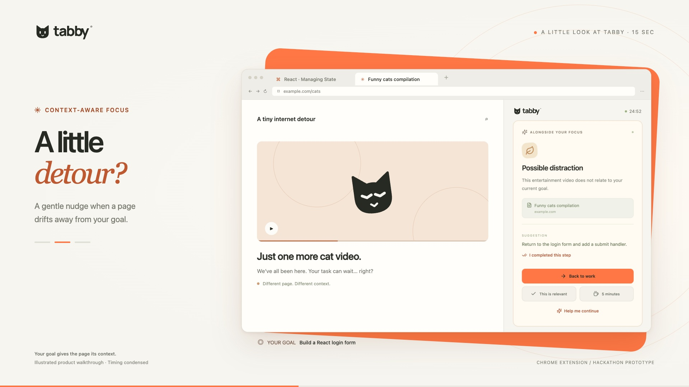
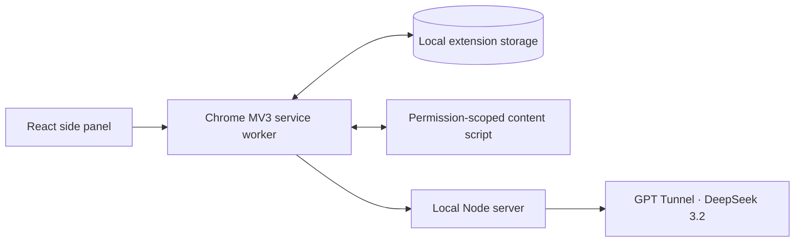

<p align="center">
  
</p>

<h1 align="center">Less chaos. More focus.</h1>
<p align="center">A context-aware Chrome extension for tasks, focus sessions, and a calmer browser.<br><strong>Built as a working hackathon prototype.</strong></p>
<p align="center"><a href="#extension-and-local-server">Try the extension</a> · <a href="#what-works">Features</a> · <a href="#development">Development</a></p>

[](public/demo/tabby-focus-demo.mp4)

**[Watch the 15-second demo →](public/demo/tabby-focus-demo.mp4)** A React task, a distracting tab, and one click back to work. This is an illustrated walkthrough using actual Tabby UI assets; the sequence is condensed for the video.

## Why we built Tabby

A tutorial and a distraction can live on the same website. Blocking the domain misses the point: what matters is the goal you started with.

Tabby keeps that goal close. Start a focus session, let the extension assess the page using the context you allow, and get a gentle nudge when you drift. Correct a suggestion, take a break, or return to your working tab. You stay in control.

## What works

| Feature | What you can do today |
| --- | --- |
| Context-aware focus | Compare the active page with your goal; see a reason and a suggested next step. |
| Gentle reminders | Choose a nudge or a reversible distraction cover. Correct the assessment or stop anytime. |
| Focus and break timers | Set a duration, pause, resume, and take timed breaks. Closing the panel preserves your session. |
| Pick up where you left off | Keep your goal, working tabs, and last confirmed step ready for your return. |
| Tasks from pages | Capture selected text, optionally ask AI for an editable draft, and keep the source attached. |
| Real browser tabs | Search and switch tabs, review AI grouping suggestions, and create actual Chrome tab groups. |
| Duplicate cleanup | Choose exact duplicate tabs to close while keeping another copy. |
| Session insights | Review observed time, breaks, time away, reminders, returns, and confirmed task completions. |

The extension uses **DeepSeek 3.2 through GPT Tunnel**. AI requires a configured local server; manual tasks and timers work without a model connection. English is the primary product language.

The landing page also has an interactive workspace preview with local tasks and a timer. Its data is separate from the installed extension, and it cannot access your real browser tabs.

## Extension and local server

**Requirements:** Node.js 24.x, npm, Chrome 120+, and your own GPT Tunnel API key for AI features.

```sh
git clone https://github.com/GeorgeItsMe/hack_openai.git
cd hack_openai
npm ci
npm run setup
```

Set the following values in your local `.env`:

```dotenv
GPTUNNEL_API_KEY=your_own_key
GPTUNNEL_BASE_URL=https://gptunnel.ru/v1
GPTUNNEL_MODEL=deepseek-v3.2
```

Keep the generated pairing token and other setup values. Build the extension and start its local server:

```sh
npm run build
npm run server
```

Leave the server running, then:

1. Open `chrome://extensions` and enable **Developer mode**.
2. Click **Load unpacked** and select the project's **`dist/extension`** folder.
3. Pin **Tabby** and click its icon to open the side panel.
4. Open **Settings**. Paste the contents of `.local/pairing.txt` into **Local server connection token**, then click **Connect & check**. This is a separate connection token, not your provider API key.
5. Review the data disclosure and enable **Allow AI analysis**. Reading visible page text requires its separate toggle and permission for that site.
6. Enter a goal and click **Start focusing**. Stay on a relevant page for roughly eight seconds plus model response time, then try another page and inspect the suggestion.

After extension changes, run `npm run build` and click Reload on its card in `chrome://extensions`. Refresh the test webpage when its content script changes. Restart the local server after server or `.env` changes.

### A quick hackathon demo

With the local server running, use a second terminal:

```sh
npx playwright install chromium
npm run demo
```

This opens a separate Chrome for Testing profile, pairs Tabby, and runs a real DeepSeek cycle on prepared React and entertainment pages. It then returns to work and pauses the session for your presentation. The calls use your provider balance.

Use `npm run demo -- --ready` to open the prepared pages without running the automatic walkthrough. Do not run a second demo while its existing browser/profile is open.

### Sharing the prototype

For hackathon judges and early testers, package the built extension as a **GitHub Release asset**:

```sh
npm run package:extension
```

The command produces **`dist/tabby-extension.zip`** with the manifest, browser bundles, and icons. Attach this ZIP to a versioned GitHub Release alongside the source link and these setup instructions. Testers extract it and use **Load unpacked** on the extracted folder containing `manifest.json`.

The local AI server still needs to run on the tester's computer with their own API key. A ZIP alone does not provide the server or an AI account. Provider credentials and pairing tokens are excluded from the archive. The prototype is currently installed through Developer mode; there is no published Chrome Web Store listing yet.

## How it works



TypeScript handles timing, state, validation, and browser actions. The model supplies structured suggestions. Zod validates the outputs; stale responses are rejected when the page, goal, or session changes. Suggested tab groups are reviewed before they are applied.

## Data and control

- Your API key stays on the local server. The browser uses a separate pairing token, and the server checks the extension origin.
- AI receives the authorized goal, task, page title, cleaned URL, and relevant session context. Visible text is optional and limited to 4,000 characters.
- Form values, cookies, and full browsing history are not collected. Site exclusions and analysis controls are available in Settings.
- Tasks and sessions are stored locally. A distraction cover can be dismissed with Escape; suggestions do not run generated JavaScript.

The prototype does not transcribe video or audio. Time on a page is an observation, not proof of productivity. Previously stored text and user-authored content are preserved when the interface language changes.

## Development

**Stack:** Chrome Manifest V3 · React · TypeScript · Zod · Node.js · esbuild · Vite · Playwright.

| Command | Purpose |
| --- | --- |
| `npm run dev:landing` | Run the landing page and interactive preview locally. |
| `npm run dev` | Open the extension UI as a web preview. |
| `npm run build` | Type-check and build the Chrome extension. |
| `npm run build:landing` | Type-check and build the website. |
| `npm run package:extension` | Build and package the extension ZIP. |
| `npm test` | Run unit, protocol, and HTTP tests without live AI calls. |
| `npm run test:smoke` | Check the built UI and native Chrome side panel. |
| `npm run test:browser` | Exercise Chrome APIs with an explicitly simulated AI adapter; port 4318 must be free. |
| `npm run test:live` | Run three real, potentially billable model requests. |
| `npm run models` | Check the model catalog available to your key. |

The project has passed 23 unit/protocol/HTTP tests, 20 browser scenarios, and a separate UI smoke check. Earlier live checks verified DeepSeek responses and the focus → distraction → return flow. Simulated browser responses are not evidence of live model quality. Detailed run history is in [the testing notes](docs/TESTING.md).

```text
src/extension/       Side panel, worker, content script, manifest
src/shared/          Types, time accounting, privacy, AI schemas
src/server/          Local HTTP server and model adapter
src/App.tsx          Landing page
src/Workspace.tsx    Interactive website preview
public/brand/        Tabby logos and artwork
public/demo/         15-second video, poster, and captions
scripts/            Build, packaging, demo, and media tools
tests/              Unit and browser checks
```

## What comes next

MCP access for AI assistants is being developed separately. Account sync, connected task inboxes, Gmail/Notion/Slack integrations, and ongoing workspace chat are future work. Their appearance in the roadmap is not a claim that they are connected today.

For the next coding agent, start with [AGENTS.md](AGENTS.md) and [AGENT_HANDOFF.md](AGENT_HANDOFF.md). For the short video, see [the render notes](scripts/video/README.md).
