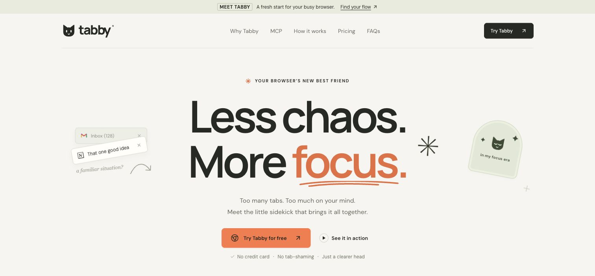
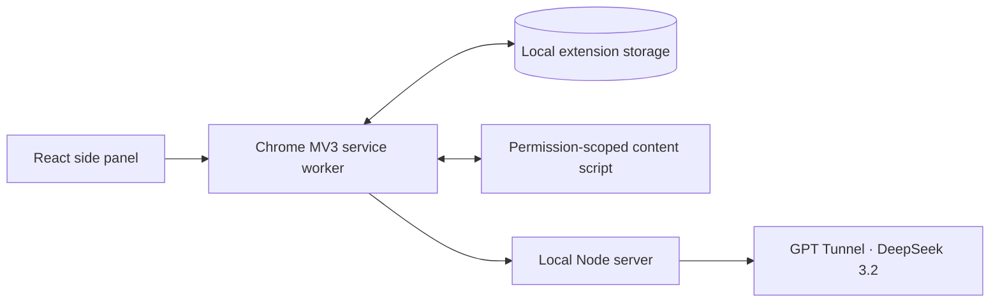

<p align="center">
  
</p>

<h1 align="center">Less chaos. More focus.</h1>
<p align="center">A context-aware Chrome extension for tasks, focus sessions, and a calmer browser.<br><strong>Built as a working hackathon prototype.</strong></p>
<p align="center"><a href="https://tabby-pi.vercel.app/">Try Tabby</a> · <a href="docs/INSTALLATION.md">Install the extension</a> · <a href="#why-we-built-tabby">The concept</a> · <a href="#what-works">Features</a> · <a href="#development">Development</a></p>

**[Download Tabby.zip](https://tabby-pi.vercel.app/downloads/Tabby.zip)** — ready to install in Chrome. Unzip it, enable Developer mode, then choose Load unpacked and select the Tabby folder. [Three-step guide](docs/INSTALLATION.md). Click **Enable AI** once: DeepSeek is included, with no account, API key or local server needed. Google and MCP are optional advanced connections.

**Tabby × Ambiguous:** we used Ambiguous to organize Tabby's product brief, architecture decisions, delivery tasks and release evidence, and used Ambi to review and refine our demo narrative. We also built an Ambiguous MCP integration into the extension. [Open the workspace references](docs/AMBIGUOUS_WORKSPACE.md) · [See the demo walkthrough](docs/AMBIGUOUS_DEMO.md).

[](https://tabby-pi.vercel.app/)

**[Watch the one-minute browser demo →](public/demo/tabby-browser-demo.mp4)** Actual Chrome and DeepSeek responses, edited with condensed timing: focus, distraction, return, task capture and tab groups. [Capture and editing notes](scripts/video/BROWSER-DEMO.md). The [earlier 15-second illustrated walkthrough](public/demo/tabby-focus-demo.mp4) remains available.

## Why we built Tabby

**We live in a distracted world.** Work, messages, feeds, meetings, and endless recommendations all compete for the same attention. Our browser puts them a click apart. You open a tab to finish something, follow one link, check one message, and suddenly have 37 tabs and a very good question: what was I doing?

We built Tabby around that moment. The idea is to keep your intention visible while you move through a noisy digital world, and make finding your way back feel easy. Getting distracted is human. Returning should feel like picking up a thread, without a guilt trip.

A tutorial and a distraction can live on the same website. Blocking the domain misses the point: what matters is the goal you started with.

Tabby keeps that goal close. Start a focus session, let the extension assess the page using the context you allow, and get a gentle nudge when you drift. Correct a suggestion, take a break, or return to your working tab. You stay in control.

Tasks, projects, notes, connected tools, and browser tabs support the same idea: keep the next meaningful step close to the work itself. Our ambition is a calmer place to work, where technology helps you spend your attention on what you choose.

## What works

| Feature | What you can do today |
| --- | --- |
| Context-aware focus | Compare the active page with your goal; see a reason and a suggested next step. |
| Gentle reminders | Choose a nudge or a reversible distraction cover. Correct the assessment or stop anytime. |
| Focus and break timers | Set a duration, pause, resume, and take timed breaks. Closing the panel preserves your session. |
| Pick up where you left off | Keep your goal, working tabs, and last confirmed step ready for your return. |
| Tasks from pages | Capture selected text, optionally ask AI for an editable draft, and keep the source attached. |
| Real browser tabs | Search and switch tabs, review AI grouping suggestions, and create actual Chrome tab groups. |
| Duplicate cleanup | Choose exact duplicate tabs to close while keeping another copy. |
| Session insights | Review observed time, breaks, time away, reminders, returns, and confirmed task completions. |
| Projects and notes | Organize tasks, notes and saved links; archive projects and filter/export reports. |
| Local MCP | Five tools read sessions/tasks/tabs and create or complete tasks with separate permission. |
| AI chat | Plan work and confirm proposed task or focus actions. |
| Google connectors | Read selected Calendar/Gmail data and import tasks; developer OAuth setup is required. |
| Ambiguous | Review chat messages as tasks and explicitly send session reports; live account delivery remains unverified. |
| Chrome workspace sync | Opt in to sharing projects, tasks, notes and saved links; delivery between computers remains unverified. |

The extension uses **DeepSeek 3.2 through GPT Tunnel** via Tabby Cloud. The hackathon preview includes AI: install, review the short data disclosure and click **Enable AI**. The project pays provider usage; users need no key, account or local server. Fair-use limits apply. Manual tasks and timers work with AI disabled. English is the primary product language.

The landing page also has an interactive workspace preview with local tasks and a timer. Its data is separate from the installed extension, and it cannot access your real browser tabs.

## Extension and local server

**Advanced and optional.** The download already includes hosted AI. Use the setup below only for your own local provider or connected tools. Hosted service details: [Tabby Cloud](docs/CLOUD_AI.md).

**Requirements:** Node.js 24.x, npm, Chrome 120+, and your own GPT Tunnel API key for AI features.

```sh
git clone https://github.com/GeorgeItsMe/hack_openai.git
cd hack_openai
npm ci
npm run setup
```

Set the following values in your local `.env`:

```dotenv
GPTUNNEL_API_KEY=your_own_key
GPTUNNEL_BASE_URL=https://gptunnel.ru/v1
GPTUNNEL_MODEL=deepseek-v3.2
```

Keep the generated pairing token and other setup values. Build the extension and start its local server:

```sh
npm run build
npm run server
```

Leave the server running, then:

1. Open `chrome://extensions` and enable **Developer mode**.
2. Click **Load unpacked** and select the project's **`dist/extension`** folder.
3. Pin **Tabby** and click its icon to open the side panel.
4. Open **Settings → Connected tools & advanced settings**. Paste `.local/pairing.txt` into **Local server connection token**, then click **Use local AI**. This is a separate connection token, not your provider API key.
5. Review the data disclosure and enable **Allow AI analysis**. Reading visible page text requires its separate toggle and permission for that site.
6. Enter a goal and click **Start focusing**. Stay on a relevant page for roughly eight seconds plus model response time, then try another page and inspect the suggestion.

After extension changes, run `npm run build` and click Reload on its card in `chrome://extensions`. Refresh the test webpage when its content script changes. Restart the local server after server or `.env` changes.

### A quick hackathon demo

With the local server running, use a second terminal:

```sh
npx playwright install chromium
npm run demo
```

This opens a separate Chrome for Testing profile, pairs Tabby, and runs a real DeepSeek cycle on prepared React and entertainment pages. It then returns to work and pauses the session for your presentation. The calls use your provider balance.

Use `npm run demo -- --ready` to open the prepared pages without running the automatic walkthrough. Do not run a second demo while its existing browser/profile is open.

### Sharing the prototype

The ready-to-install [Tabby.zip](https://tabby-pi.vercel.app/downloads/Tabby.zip) is served by the landing. It contains only the browser extension and a short installation guide. Users extract it and choose **Load unpacked** on the Tabby folder containing `manifest.json`.

To refresh the public download from the current source:

```sh
npm run build
node scripts/package-extension.mjs --landing
node scripts/verify-download.mjs
node --import tsx tests/package-browser.ts
```

Commit the updated ZIP and its metadata alongside the matching source. `npm run package:extension` also produces local `dist/Tabby.zip` and the legacy `dist/tabby-extension.zip`. [Packaging and release details](docs/INSTALLATION.md).

The local AI server still needs the user's own API key; the browser ZIP does not include that server or account credentials. This is a manual-install preview, with no Chrome Web Store listing yet.

## How it works



TypeScript handles timing, state, validation, and browser actions. The model supplies structured suggestions. Zod validates the outputs; stale responses are rejected when the page, goal, or session changes. Suggested tab groups are reviewed before they are applied.

## Data and control

- Your API key stays on the local server. The browser uses a separate pairing token, and the server checks the extension origin.
- AI receives the authorized goal, task, page title, cleaned URL, and relevant session context. Visible text is optional and limited to 4,000 characters.
- Form values, cookies, and full browsing history are not collected. Site exclusions and analysis controls are available in Settings.
- Tasks and sessions are stored locally. A distraction cover can be dismissed with Escape; suggestions do not run generated JavaScript.

The prototype does not transcribe video or audio. Time on a page is an observation, not proof of productivity. Previously stored text and user-authored content are preserved when the interface language changes.

## Development

**Stack:** Chrome Manifest V3 · React · TypeScript · Zod · Node.js · esbuild · Vite · Playwright.

| Command | Purpose |
| --- | --- |
| `npm run dev:landing` | Run the landing page and interactive preview locally. |
| `npm run dev` | Open the extension UI as a web preview. |
| `npm run build` | Type-check and build the Chrome extension. |
| `npm run build:landing` | Type-check and build the website. |
| `npm run package:extension` | Build and package the extension ZIP. |
| `npm test` | Run unit, protocol, and HTTP tests without live AI calls. |
| `npm run test:smoke` | Check the built UI and native Chrome side panel. |
| `npm run test:browser` | Exercise Chrome APIs with an explicitly simulated AI adapter on an ephemeral backend port; the user's AI server stays running. |
| `npm run test:live` | Run three real, potentially billable model requests. |
| `npm run models` | Check the model catalog available to your key. |

The current source passes 48 unit/protocol tests. Browser suites cover core focus/tab behavior, workspace/MCP, Google/chat and Ambiguous, with separate native Side Panel and packaged-download checks. External-service fixtures are not live account verification. [Run history and limits](docs/TESTING.md).

GitHub Actions runs the extension build, unit tests, source-to-ZIP comparison and landing build for pushes and pull requests. A stale browser download fails verification rather than silently shipping a different build.

```text
src/extension/       Side panel, worker, content script, manifest
src/shared/          Types, time accounting, privacy, AI schemas
src/server/          Local HTTP server and model adapter
src/mcp/             Local stdio MCP server and authenticated browser bridge
src/App.tsx          Landing page
src/Workspace.tsx    Interactive website preview
public/brand/        Tabby logos and artwork
public/demo/         15-second video, poster, and captions
scripts/            Build, packaging, demo, and media tools
tests/              Unit and browser checks
```

## Projects, MCP and workspace sync

Tabby now supports projects with linked tasks, pinned browser links and multiline notes. Projects can be archived and restored. Insights adds period/project filters, daily totals, classification coverage and a JSON report export.

The local MCP server reads live sessions, tasks and browser tabs, then creates or completes tasks when separate write access is enabled. Run `npm run setup:mcp`, reload the built extension and follow [MCP setup](docs/MCP.md). It uses an independent token and loopback bridge; DeepSeek remains the extension's default model.

Optional Chrome account sync shares projects, tasks, notes and saved links. It preserves local settings and handles conflicts and quota errors explicitly. See [projects, sync and analytics](docs/PROJECTS_AND_SYNC.md) for setup and limits. Real Chrome storage operations are verified; delivery between two signed-in computers is not yet verified.

`npm run test:workspace` exercises the installed extension with an official SDK MCP client, including real data, writes, retries, worker restart and access revocation, without model calls. Cloud-hosted MCP access and collaborative server workspaces are not included.

## Google Calendar, Gmail and AI chat

Open **Calendar & mail** for a read-only two-week agenda and the latest inbox previews. Import items into tasks, or review an AI draft from an email. **AI chat** keeps a conversation and offers confirmed cards to create/complete tasks and start focus. Calendar sharing is optional; DeepSeek remains the default model.

Google requires your own **Desktop app OAuth client**: enable the Calendar/Gmail APIs, configure the consent screen/test user, then run `npm run setup:google -- /path/to/client.json`. Restart the local server and reload the built extension. Credentials stay under `.local/`. Full setup, privacy and limitations: [Google and chat](docs/GOOGLE_AND_CHAT.md).

`npm run test:google-chat` checks real extension UI/storage with explicit API fixtures. A synthetic live DeepSeek chat request also passed; live Google account access remains unverified until an OAuth client is configured.

## Ambiguous team chat

**Ambiguous → Connect Ambiguous** opens account sign-in. Load a channel, review a message as a task, focus on it, then review and explicitly send the session report to its original thread. The local server connects to `https://app.ambiguous.ai/mcp`; a documented REST adapter is also available. Chat reads and factual reports do not call the AI provider. Credentials stay on the user's local server.

Setup, delivery protection and limits: [Ambiguous integration](docs/AMBIGUOUS.md). `npm run test:ambiguous` verifies the full Chrome → local HTTP → SDK MCP path against a chat fixture. **Live extension OAuth/MCP access and real chat delivery are not yet verified.** Restart the updated local server and reload the extension before connecting. Our final-delivery project and completed release-verification task were created and used in the real Ambiguous workspace; see [the hackathon walkthrough](docs/AMBIGUOUS_DEMO.md).

For the next coding agent, start with [AGENTS.md](AGENTS.md) and [AGENT_HANDOFF.md](AGENT_HANDOFF.md). For the short video, see [the render notes](scripts/video/README.md).
