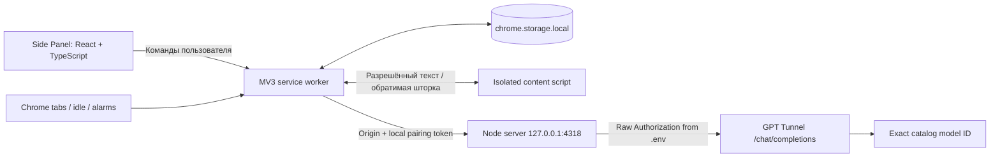

# Архитектура

`engine.ts` — детерминированный интегратор времени. `settle(now)` начисляет интервал с `accountedAt` в одну категорию, уменьшает оставшееся время только при работе и присутствии, обрезает интервал по дедлайну, корректно разбивает прошедший перерыв и последующее ожидание. Alarm не является счётчиком секунд. Панель только отображает проекцию сохранённого состояния.

Состояние меняется в последовательной очереди worker, а сетевые запросы идут вне очереди. Смена вкладки отменяет AbortController и увеличивает generation; изменения цели/задачи/режима увеличивают revision. После ответа проверяются generation, session ID, revision, phase, presence и fingerprint страницы. Старая оценка не может примениться к новому контексту. Дополнительный кэш содержит до 150 оценок с TTL 2 минуты; поправки живут в конкретном сеансе и сбрасываются при смене цели/задачи.

Content script внедряется по запросу при наблюдении/чтении, не регистрируется глобально на все сайты. MutationObserver объединяет изменения и сравнивает отпечаток URL/заголовка/разрешённого текста. При паузе/завершении он отключается. Шторка создаётся в закрытом Shadow DOM поверх страницы, не меняет URL, DOM формы или её значения. Escape и кнопки всегда позволяют её снять. Lease не переживает неисправность extension worker бесконечно.

Сервер — стандартный Node HTTP без framework. `Provider` получает каталог, проверяет выбранную модель и отсутствие подмены, ограничивает время и объём ответа, очищает входные данные и валидирует структурированный результат. Отдельная server-side функция проверяет дату по точному фрагменту источника. Только ограниченные известные действия доступны браузерному коду; рекомендации сами не вызывают Chrome API.

Список вкладок для модели — до 100 записей. Перед применением групп повторно проверяются существование, окно и контекст вкладок. Закрытие дубликатов независимо перепроверяет полные URL непосредственно перед удалением и требует невыбранную вкладку с тем же URL.

Граница тестирования: unit/protocol используют фиктивный fetch. Browser tests используют настоящий Chromium, Chrome APIs и HTTP-сервер с явно фиктивным semantic adapter. Live smoke test отдельно вызывает GPT Tunnel и записывает отчёт. В production-сборке нет fixture-provider или переключателя на вымышленные ответы.
